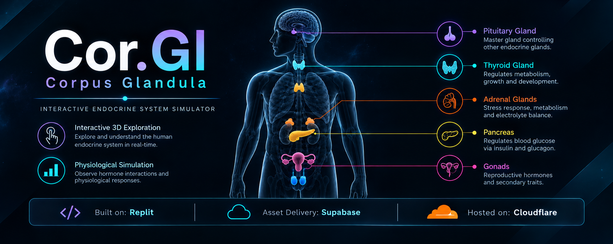

  

# 🧬 Corpus Glandula

### *Interactive Endocrine System Simulator*

> **Corpus Glandula** is an interactive visualization exploring the **human endocrine system**, hormonal regulation, and physiological responses through 3D anatomy and simulation.

> 🧬 **Endocrinology** · 🧠 **Hormonal Regulation** · 🩸 **Physiology**

**🔬 [Explore the Simulation](https://corpus-glandula.dray-ashcroft.workers.dev/)**

---

## ✦ Features

**🧍 Interactive 3D Anatomy**  
Explore the human endocrine system through an interactive, rotatable 3D body model.

**🧪 Hormone Simulations**  
Visualize hormonal activity and physiological responses through interactive controls.

**🔬 Scientific Visualization**  
Explore endocrine structures and physiological processes through a browser-based interactive experience.

**📱 Responsive Design**  
Optimized for modern desktop and mobile devices.

---

## 🧬 Core Concepts

**Endocrine Glands · Hormones · Hormonal Regulation · Homeostasis · Physiological Responses · 3D Anatomy**

---

## ⚙️ Technology

**HTML · CSS · JavaScript**

**Asset Delivery:** Supabase  
**Repository:** GitHub & Codeberg  
**Hosting:** Cloudflare

---

## 📜 License

**GNU General Public License v3.0 (GPL-3.0)**
